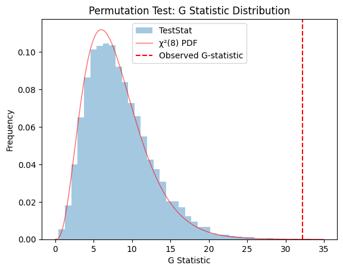
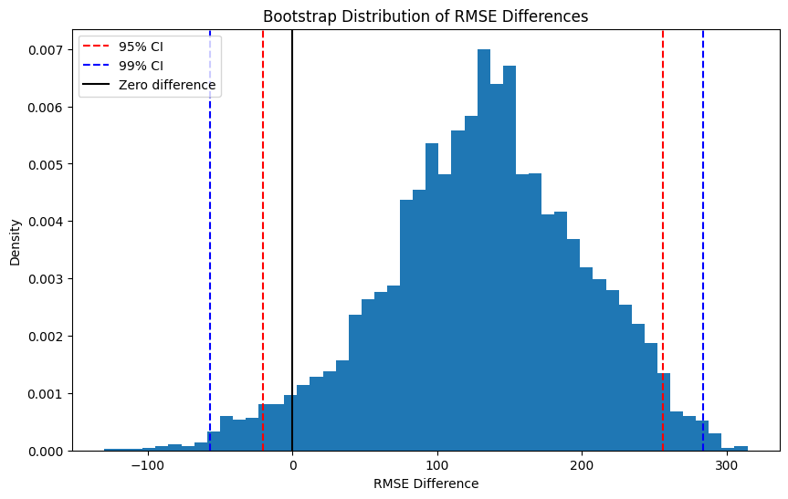
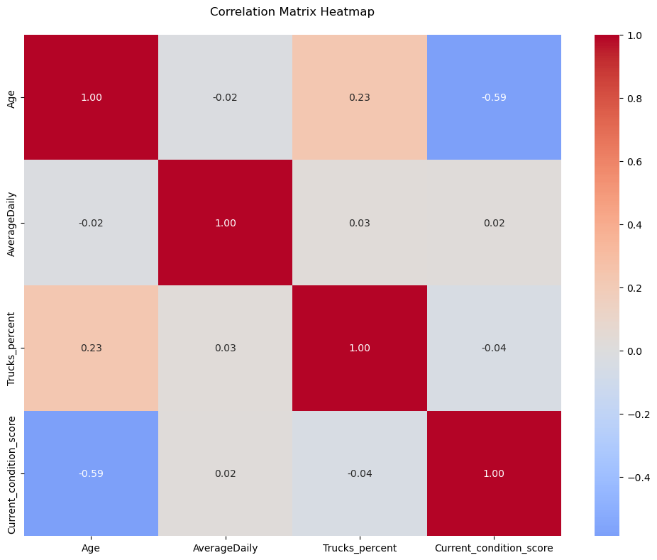
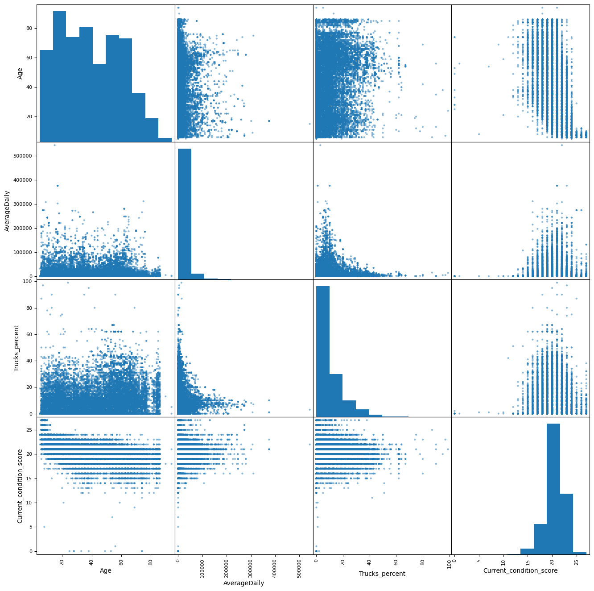
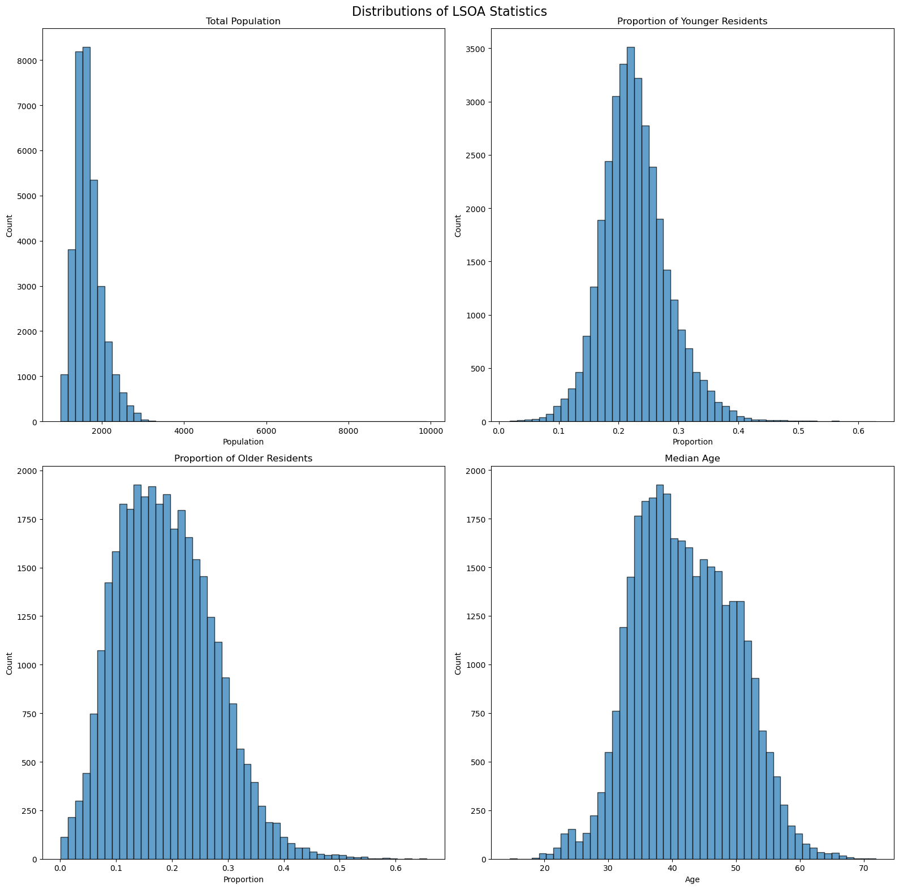
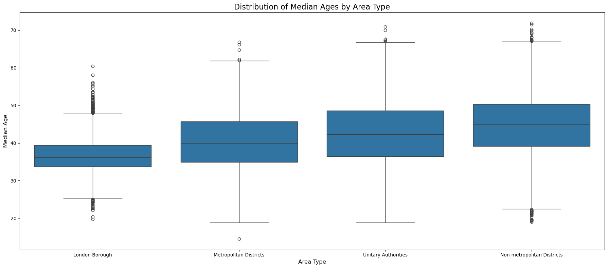
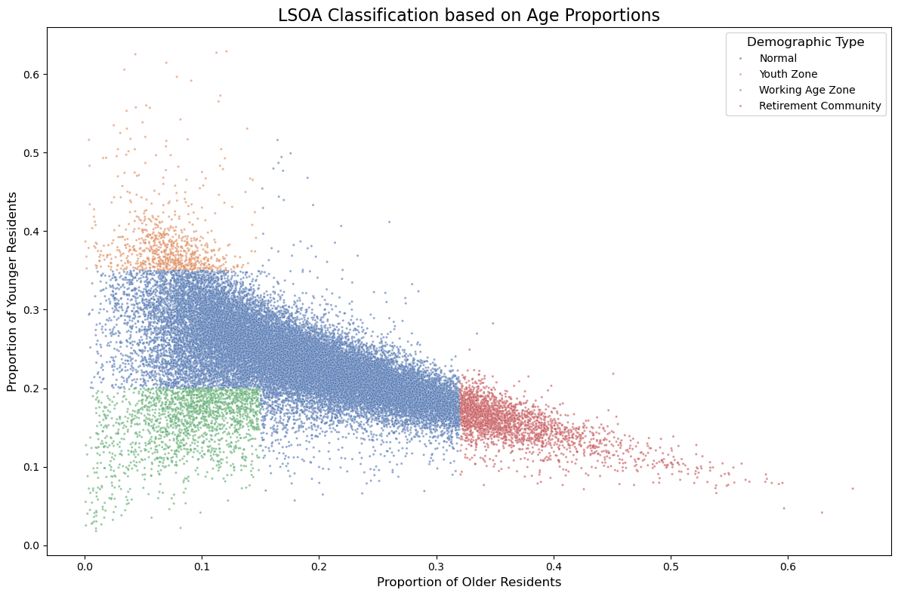

# 📊 Statistical Modeling and Data Analysis with Python  

A showcase of applied **statistical modeling and data analysis with Python**, featuring hypothesis testing, regression, bootstrap resampling, and demographic insights across real-world datasets.  

---

## **Task 1 – Property Prices & Statistical Testing**  
**Description**  
Analyzed average flat prices in different UK regions (July 2017 – July 2018) and tested whether price changes were independent of region.  

**Techniques & Methods**  
- Data processing with **pandas**: computed absolute and percentage price changes.  
- **Visualization** with *matplotlib* and *seaborn* to compare regional price dynamics.  
- **Statistical inference**:  
  - Cross-tabulation of regions vs. price increases/decreases.  
  - **Chi-square test (G-test)** for independence.  
  - **Permutation test** as a non-parametric alternative.  
- Comparative discussion of the two statistical tests, interpretation of p-values, and conclusions.  

**Highlights**  
- Combined **exploratory data analysis** with **formal hypothesis testing**.  
- Explained results in the context of real-world socioeconomic data.

  
   
  <em>Figure 1: Permutation Test – G Statistic Distribution</em>

---

## **Task 2 – Storks Deliver Babies (Regression & Bootstrap)**  
**Description**  
Reproduced and extended a classic statistical case study (Matthews, 2000) on the correlation between stork populations and human birth rates. Compared simple and multivariate regression models, and used bootstrapping to assess model performance.  

**Techniques & Methods**  
- **Regression modeling**:  
  - Model 1: simple linear regression with stork counts as predictor.  
  - Model 2: multiple regression with population size, GDP per capita, and population density.  
- **Model evaluation**: R², residual plots, and error metrics.  
- **Bootstrap resampling**:  
  - Constructed RMSE difference distribution between models.  
  - Estimated **confidence intervals** (95%, 99%) for performance comparison.  
- Discussion of bootstrap principles, model comparison results, and interpretation of causal factors.  

**Highlights**  
- Showed the importance of distinguishing **correlation vs. causation**.  
- Applied **bootstrap methods** to evaluate model robustness.

  
   
  <em>Figure 2: Bootstrap Distribution of RMSE Differences</em>

---

## **Task 3 – Texas Bridge Condition Analysis (Regression Modeling)**  
**Description**  
Analyzed Texas bridge infrastructure data to predict current bridge condition based on structural, usage, and design factors.  

**Techniques & Methods**  
- **Data preparation**:  
  - Derived **Age** from year of construction.  
  - Filtered historic/very old bridges.  
  - Merged small categories of **Material** and **Design**.  
  - Constructed a composite **Condition Score**.  
- **Exploratory analysis**: visualized relationships among predictors and target.  
- **Regression modeling**:  
  - Linear regression with five predictors (Age, AverageDaily, Trucks_percent, Material, Design).  
  - Evaluated **R²** and residuals.  
  - Compared regression coefficients to determine predictor influence.  

**Highlights**  
- Combined **feature engineering, EDA, and regression analysis**.  
- Provided actionable insights for infrastructure management (e.g., traffic and age effects).

<table>
  <tr>
    <td></td>
    <td></td>
  </tr>
  <tr>
    <td align="center"><strong>Figure 3: Correlation Matrix Heatmap</strong></td>
    <td align="center"><strong>Figure 4: The Scatter Matrix</strong></td>
  </tr>
</table>

---

## **Task 4 – Demographic Analysis of England (Census Data)**  
**Description**  
Analyzed 2021 census data at the LSOA (Lower Layer Super Output Area) level to explore age distributions, median ages, and demographic patterns across England.  

**Techniques & Methods**  
- **Data manipulation** with Pandas: derived proportions of young/old residents and estimated median ages per LSOA.  
- **Visualization**:  
  - Bar charts of national vs. local age profiles.  
  - Histograms of age proportions and median ages.  
  - Scatter plots of younger vs. older population proportions.  
- **Comparative analysis**: median age distributions by area type (urban, rural, London boroughs, etc.).  
- **Classification of unusual areas**: rules to identify clusters (e.g., retirement areas, worker hubs).  

**Highlights**  
- Worked with **large-scale demographic datasets**.  
- Explained regional demographic differences in a **policy-relevant way**.

<table>
  <tr>
    <td></td>
    <td></td>
  </tr>
  <tr>
    <td align="center"><strong>Figure 5: Distributions LSOA Statistic</strong></td>
    <td align="center"><strong>Figure 6: Distribution of Median ages by Area Type</strong></td>
  </tr>
</table>

  
   
  <em>Figure 7: LSOA Classification Based On Age Proportions</em>

---

# 📌 Repository Overview  

This repository demonstrates core **statistical modeling and data analysis skills** across four diverse domains:  

- **Task 1:** Hypothesis testing & independence analysis (property prices).  
- **Task 2:** Regression modeling & bootstrap resampling (correlation vs. causation).  
- **Task 3:** Predictive modeling with feature engineering (bridge conditions).  
- **Task 4:** Demographic analysis & classification (census data).  

✨ Together, these projects showcase:  
- Proficiency in **Python (pandas, matplotlib, seaborn, scikit-learn)**.  
- Ability to apply **statistical tests, regression techniques, and resampling methods**.  
- Skill in presenting results to both **technical and non-technical audiences**.  

---
